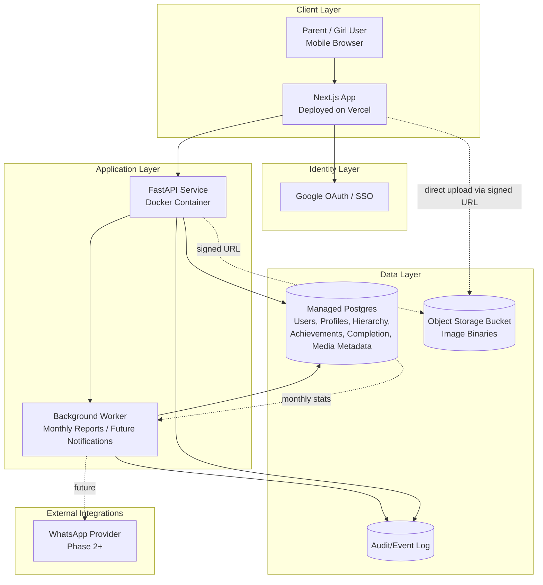
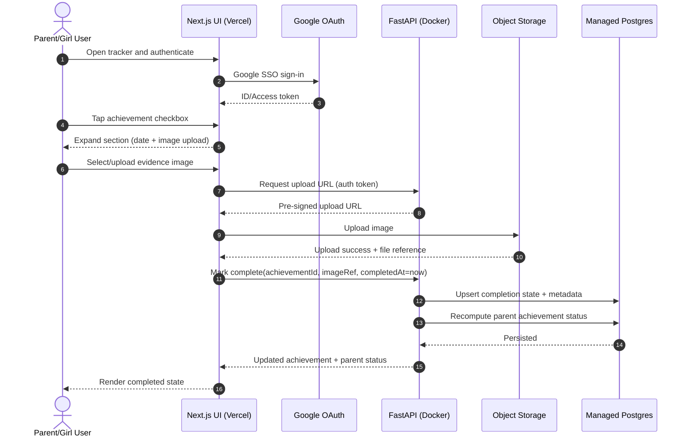
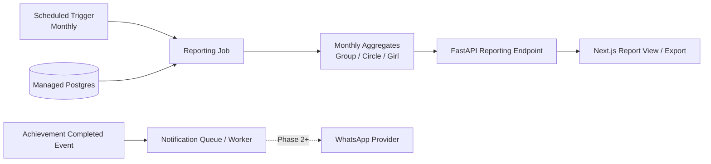

# Adventure Princess Tracker — System Design Diagrams

This document contains Mermaid diagrams for the MVP architecture and key system flows, aligned to `PRD.md`.

---

## 1) High-Level System Architecture (MVP + Extension Points)

---

## 2) Achievement Completion Flow (Checkbox → Evidence Upload → Persist)

---

## 3) Monthly Reporting + Future Notification Flow

---

## Notes

- Group is defaulted to **Adventure Guides** in MVP, but schema is modeled for future multi-group expansion.
- Admin "look on behalf" is intentionally excluded from MVP runtime path and can be introduced as an authorization extension in Phase 2.
- Keep infrastructure managed and minimal for low-maintenance operation.
- Use signed URLs for image upload/download; store only metadata/pointers in Postgres.
